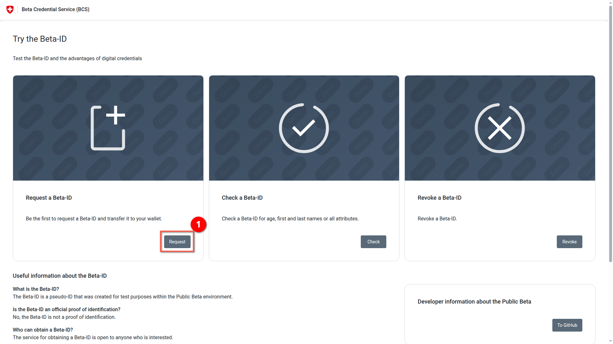
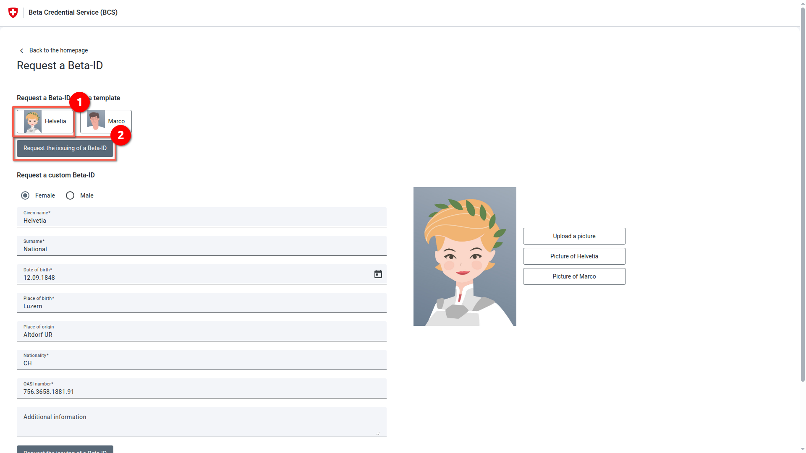
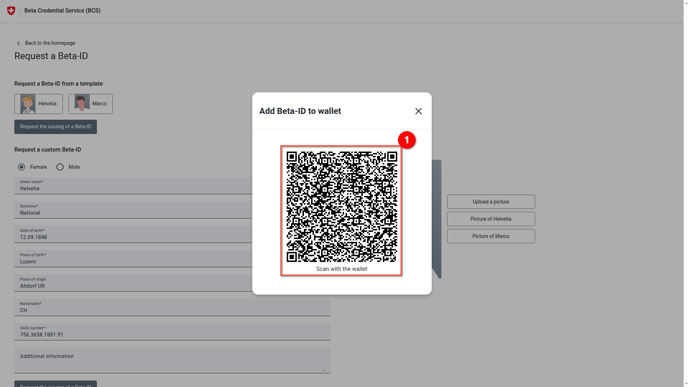
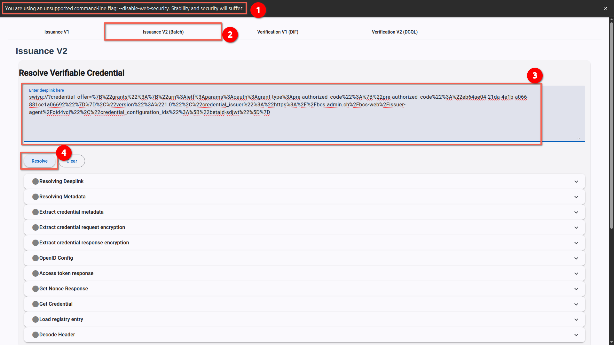
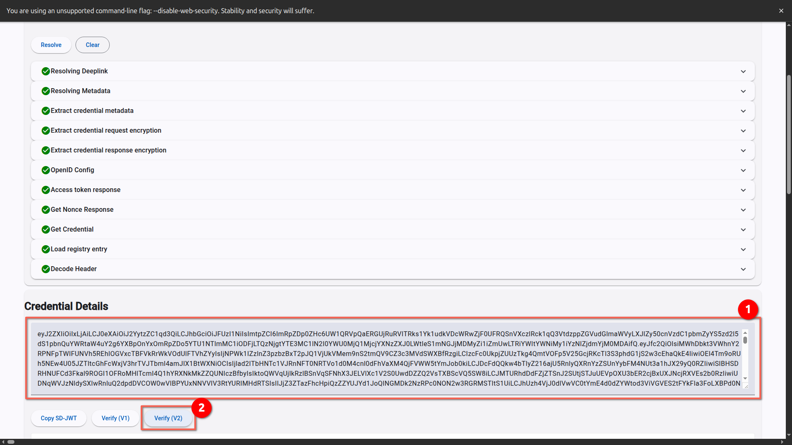
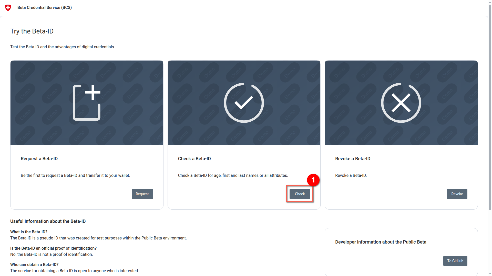
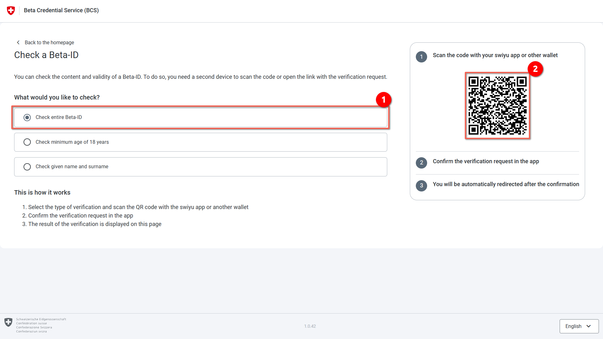
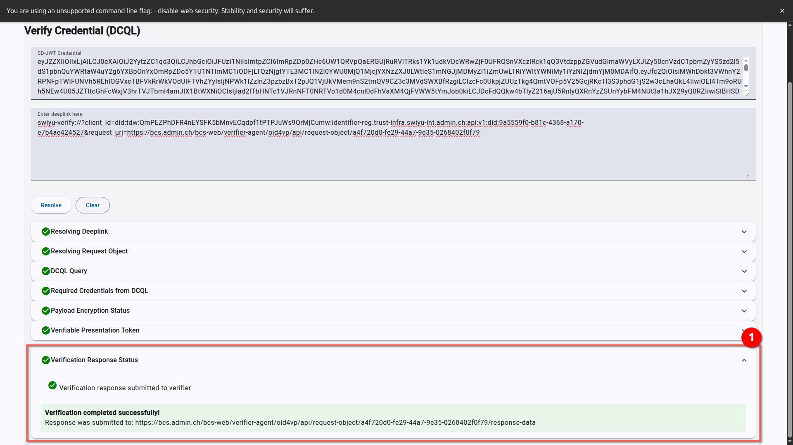
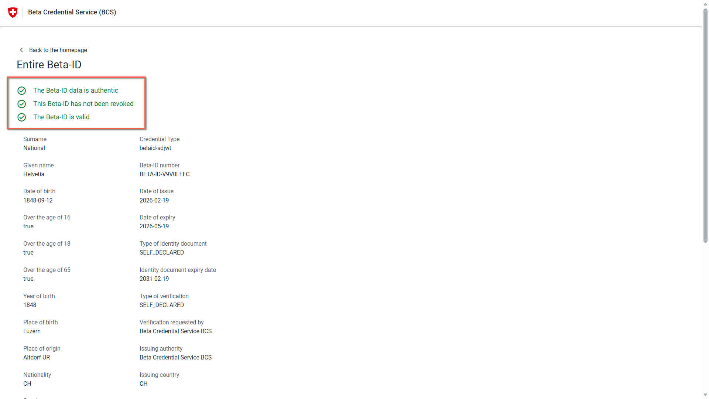
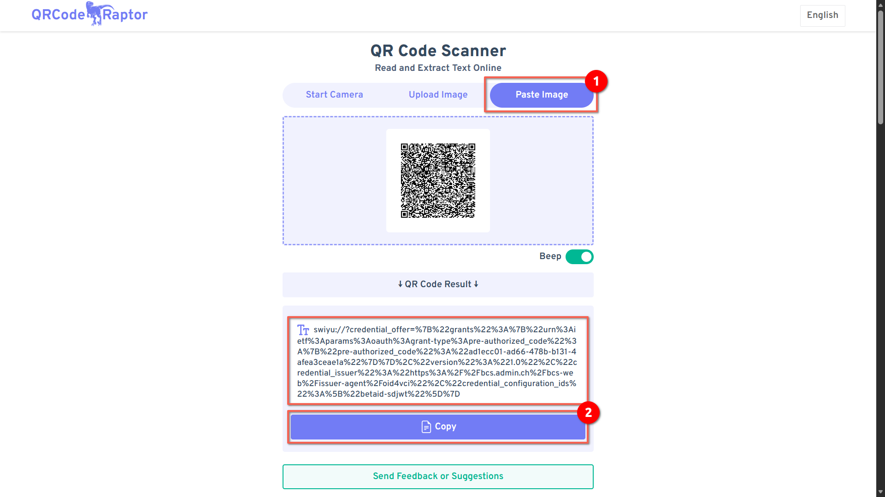

## Usage Guide

This section provides step-by-step instructions for testing credential issuance and verification flows using the swiyu Generic Test Wallet.

> **Note:** The following examples use the Public Beta ID for demonstration purposes. If you want to test against your own swiyu Generic Issuer and Verifier deployments, the steps involving the Beta Credential Service will not apply. Instead, you will need to adapt these instructions to work with your custom issuance and verification endpoints.

### Browser CORS Configuration

When testing the wallet against locally deployed backend services, the wallet needs to make HTTP requests to issuer and verifier endpoints that are hosted on different domains or ports than the wallet itself. Browsers enforce the Cross-Origin Resource Sharing (CORS) security policy, which blocks these requests by default. Therefore, *you may need to temporarily disable CORS security* during development and testing.

*⚠️ Security Warning: Disabling CORS should only be done on a separate browser profile used exclusively for development and testing. Never disable CORS on your main browser profile.*

### For Google Chrome

```bash
google-chrome --disable-web-security --user-data-dir="/tmp/chrome_dev_session"
```

### Understanding Deeplinks

The swiyu Generic Test Wallet uses `deeplink`s to initiate credential issuance and verification flows. These `deeplink`s are typically embedded in QR codes or URLs generated by issuance and verification services.

**For Issuance Flows:**

The wallet supports the following deeplink protocols for credential issuance:
- `swiyu://...` - Custom protocol for issuance
- `openid-credential-offer://...` - Standard OIDC4VCI protocol

Extract the complete deeplink from the QR code provided by the issuance service and paste it into the wallet.

**For Verification Flows:**

The wallet supports the following deeplink protocols for verification:
- `swiyu-verify://...` - Custom protocol for verification
- `https://...` or `http://...` - Direct HTTPS/HTTP URL containing the request object
- `openid4vp://...` - Standard OIDC4VP protocol

Simply extract the complete deeplink or URL from the QR code provided by the verification service and paste it into the wallet. The wallet will automatically detect the protocol and handle the flow accordingly.

### Part 1: Beta ID Issuance

#### Request a Beta Credential

Navigate on the Beta Credential Service website [https://www.bcs.admin.ch/bcs-web/#/](https://www.bcs.admin.ch/bcs-web/#/) to the section **Request Beta ID** and click the **Request** button.



Select a profile and click the **Request the issuing of a Beta-ID** button.



#### Extract Deeplink of the Beta Credential

Copy the qr code and paste it to any QR Code Scanner. Please refer to [Extracting Deeplinks from QR Codes](#extracting-deeplinks-from-qr-codes) section.

Alternatively, you can click on the QR Code with your mouse and the `deeplink` will be copied to your clipboard.



#### Resolve the Credential in the Generic Test Wallet

You can now go to the Generic Test Wallet [https://swiyu-admin-ch.github.io/swiyu-generic-test-wallet/](https://swiyu-admin-ch.github.io/swiyu-generic-test-wallet/) without *CORS Security*, select an **Issuance V1** (Single Issuance) or **Issuance V2** (Batch Issuance). Paste the `deeplink` and click the **Resolve** button.



#### Check the result
The system should now go through several steps (Resolving `deeplink`, Metadata, Token, etc...). If everything is correct, green check marks will appear for all steps, and the Credential Details (e.g. as an SD-JWT) will be displayed at the bottom. Click the **Verify (V1)** (DIF) or **Verify (V2)** (DCQL) button to redirect to the verification tab.



### Part 2: Beta ID Verification

#### Initiate a verification

Go back to the start page of the BCS website and click the **Verify** button in the **Check a Beta ID** section.



#### Select a verification process and extract the link
Choose a verification scenario (e.g. **Check entire Beta-ID**). A QR code will appear on the right, copy the qr code and paste it to any QR Code Scanner like during the issuance process.

Alternatively, you can click on the QR Code with your mouse and the `deeplink` will be copied to your clipboard.



#### Perform Verification

Go back to the Generic Test Wallet. If you followed the previous step, you should already be on the verification tab. Paste the extracted `deeplink` into the input field and click the **Resolve** button.

The wallet will automatically detect the protocol format (whether it's `swiyu-verify://`, `https://`, `http://`, or `openid4vp://`) and process the verification flow accordingly.

#### Check verification result
The tool should resolve the request (e.g. "Resolving `deeplink`", Required Claims, etc...) with green check marks.



#### Completion
The view on the BCS website should update and display the verification result. A successful test is confirmed by the message “The Beta-ID data is authentic” with a green check mark, along with the personal data (e.g. name, date of birth).



### Extracting Deeplinks from QR Codes

#### Extract Deeplink from QR Code

You can use [https://qrcoderaptor.com/](https://qrcoderaptor.com/) or any other QR code scanner to extract the `deeplink` from a QR code. Simply upload or paste the screenshot of the QR code, and the scanner will display the decoded `deeplink` that you can then copy and use in the wallet.


